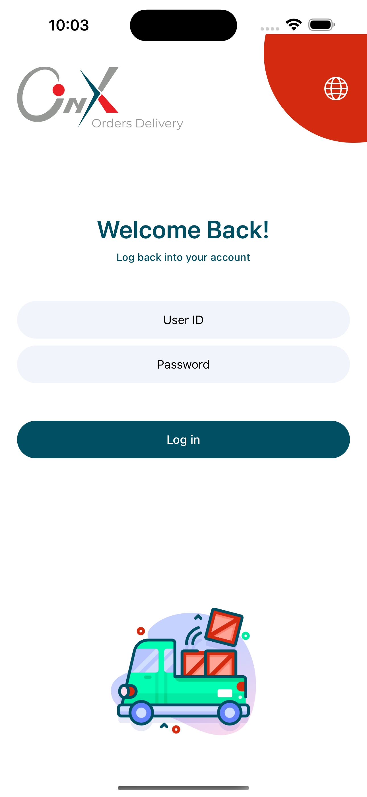
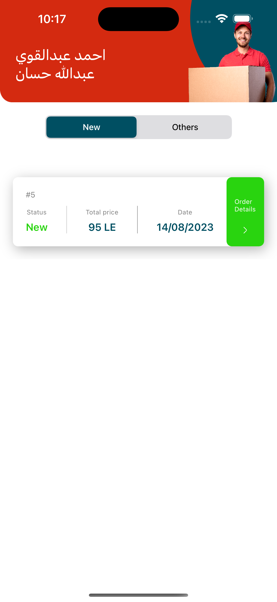
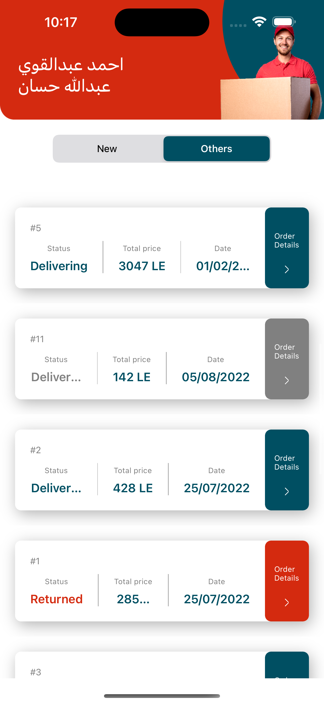

# Onyx Delivery
Onyx Delivery is designed to retrieve the order bills list from the backend API, then ensure saving it into the SQL database (with written SQL statements), after that, the app displays the cashed bills list in the table view that appears to the user (I managed to have one and only one source to display the data from.. *"Single source of truth"*).

<br>
<be>

## Features
* **Singleton Design:** The class employs the Singleton design pattern, ensuring that only a single instance of `LocalDataSource` can be created. This instance is accessed via the shared property.
  
* **Database Initialization:** Upon instantiation, the class establishes a connection to an `SQLite` database located in the application's document directory.
  
* **Table Creation:** The class creates an `SQLite` table named `Bill` if it does not already exist. This table is used to store bill-related information, including attributes such as `number`, `date`, `tax`, `status`, and `customer`.

<br>
<be>

## Data Source Functions

I've made some functions to `createTablesIfNeeded()`,
```swift
    private func createTablesIfNeeded() {
        let createTableQuery = "CREATE TABLE IF NOT EXISTS Bill (number TEXT,
                                 date TEXT, tax TEXT, status TEXT, customer TEXT);"

        if sqlite3_exec(database, createTableQuery, nil, nil, nil) != SQLITE_OK {
            print("Error creating table")
        }
    }
```

`upsertBills(bills: [Bill])`, `retrieveBills() -> [Bill]`, `removeAllBills()` in the [LocalDataSource](ios-onyx-delivery/Core/Local/SQL/LocalDataSource.swift) class.

<br>
<br>

## Environment
This project was generated with:
* IDE: Xcode
* LNG: Swift
* PATTERN: MVVM

<br>
<br>

## Author
If you have any questions, please feel free to contact the project maintainer:

- Name: [Salah Khaled](Https://www.linkedin.com/in/sala7khaled/)
- Email: sala7khaled7@gmail.com
- Website: [linktree/sala7khaled](https://linktr.ee/sala7khaled)

<br>
<br>

## Preview

| Launch | Sign In | New orders | Other orders |
| --- | --- | --- | --- |
|  |  |  |  |
